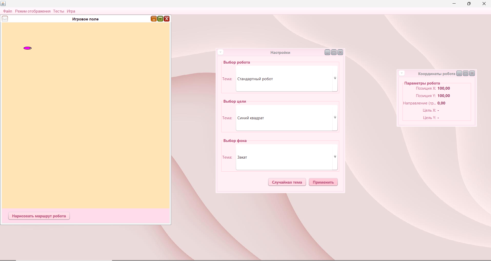
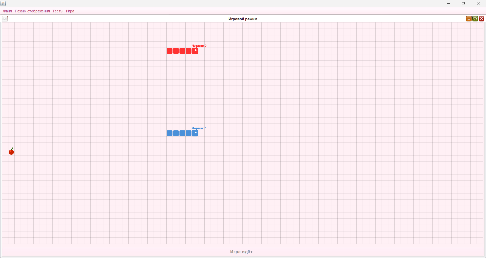
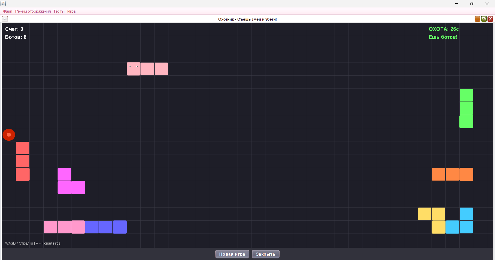
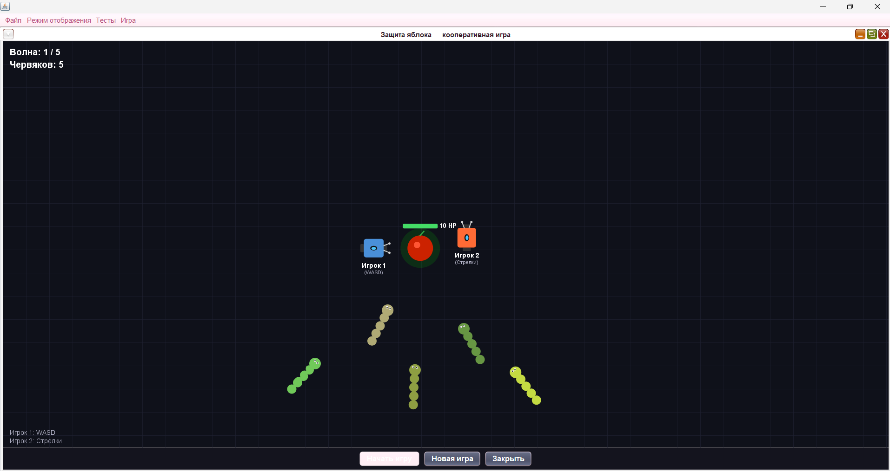

# Robot Game Java

Java desktop-приложение на Swing с симулятором робота и тремя игровыми режимами. Проект развивался от простого робота, управляемого кликом мыши, до полноценного многоконтентного приложения с системой тем, логированием и кооперативными играми.

---

## Скриншоты

### Симулятор робота с настройками тем


### Змейка — 2 игрока на одной клавиатуре


### Охотник — съешь всех ботов и убеги


### Защита яблока — кооперативная игра 2 на 2


---

## Возможности

### Симулятор робота
- Клик мышью — робот плавно едет к точке по математической модели движения
- Режим рисования маршрута — зажми и нарисуй произвольный путь
- Окно координат показывает позицию X/Y, направление и текущую цель в реальном времени

### Змейка (2 игрока)
- Два игрока на одной клавиатуре: WASD и стрелки
- Настройка имён, цветов змеек и фона перед игрой
- Побеждает тот, кто выживет последним

### Охотник
- Управляй змейкой среди ботов
- Фаза охоты: ешь ботов и набирай очки
- Фаза побега: уворачивайся от ботов пока не выйдет время
- Счёт, таймер, управление R для новой игры

### 🛡Защита яблока (кооператив)
- Два робота против волн червей — 5 волн нарастающей сложности
- Черви ползут к яблоку в центре, роботы их перехватывают
- HP яблока, счётчик волн, победа или поражение по итогу

---

## Система тем

Темы загружаются из JSON-файлов — не нужно менять код, достаточно добавить новый файл:
- **Робот** — цвет тела, глаз, размеры
- **Цель** — форма (круг / квадрат / крест), цвет, размер
- **Фон** — цвет поля, цвет маршрута

Настройки сохраняются между запусками.

---

## Архитектура

Проект построен по паттерну **MVC** с **Observer**:

```
src/
├── gui/          # View — все окна и визуализация (Swing)
│   ├── GameVisualizer.java       # Отрисовка робота и маршрута
│   ├── SnakeGameWindow.java      # Игра Змейка
│   ├── HunterGameWindow.java     # Игра Охотник
│   ├── DefenseGameWindow.java    # Игра Защита яблока
│   └── SettingsWindow.java       # Настройки тем
├── model/        # Model — логика и данные
│   ├── RobotModel.java           # Математика движения робота
│   ├── DefenseModel.java         # Логика волн и коллизий
│   ├── ThemeManager.java         # Загрузка и хранение тем
│   └── ThemeData.java            # Структуры данных тем
└── log/          # Система логирования
    └── LogWindowSource.java      # Thread-safe очередь логов
```

**Ключевые паттерны:**
- **Observer** — модели уведомляют представления об изменениях через интерфейсы `RobotModelListener`, `SnakeModelListener`, `DefenseModelListener`
- **MVC** — полное разделение логики и отображения
- **Strategy** — темы как взаимозаменяемые конфигурации

---

## Тестирование

Проект покрыт **38 unit-тестами** на JUnit 5:

| Класс | Тестов | Что проверяется |
|---|---|---|
| `RobotModelTest` | 13 | Математика движения, следование по пути, Observer |
| `DefenseModelTest` | 14 | Игровые фазы, коллизии, волны червей, границы поля |
| `ThemeManagerTest` | 11 | Загрузка тем, корректность цветов, допустимые значения |

Запуск тестов в IntelliJ: правая кнопка на папке `test` → Run All Tests.

---

## 🛠Стек технологий

- **Java 21**
- **Swing** — GUI и отрисовка
- **JUnit 5** — unit-тестирование
- **JSON** — конфигурация тем (без сторонних библиотек, парсинг вручную)
- **Observer / MVC** — архитектурные паттерны

---

## Запуск

1. Клонируй репозиторий:
```bash
git clone https://github.com/vikss-v/robot-game-java.git
```
2. Открой в **IntelliJ IDEA**
3. Запусти `RobotsProgram.main()`

Требования: **JDK 21+**

ндой из 3 студентов 2 курса матмеха УрФУ (специальность «Математика и компьютерные науки»).